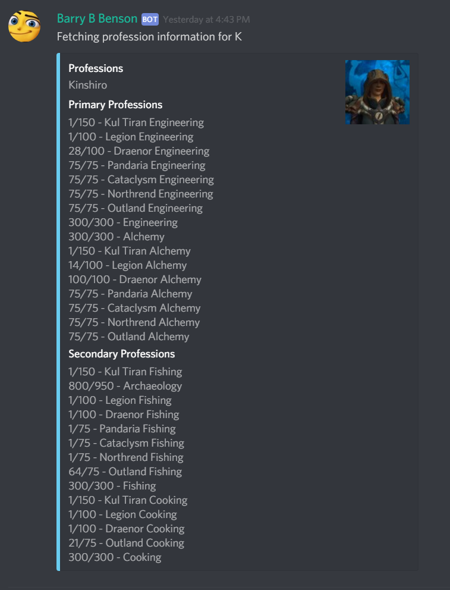

# BarryBenson
A discord bot that utilises the World of Warcraft API to display information about characters and guilds. 

# Invite to server
[Invite Link](# https://discordapp.com/oauth2/authorize?&client_id=486395215859679265&scope=bot&permissions=0)

# World of Warcraft Statistics
The ```$stat [playername] [player realm]``` command will display player infromation such as player level, race, honorable kills, achievement points and race along with an image of the player.


# World of Warcraft Professions
## Usage
```
$prof [playername] [realm]
```
Display player profession information along with a thumbnail image of the player. 


