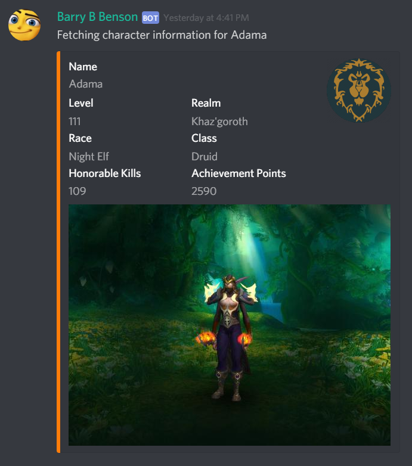

# BarryBenson
A discord bot that utilises the World of Warcraft API to display information about characters and guilds. 

# World of Warcraft Statistics
The ```$stat [playername] [player realm]``` command will display player infromation such as player level, race, honorable kills, achievement points and race along with an image of the player.

